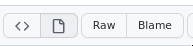

# markdown

i recommend reading why markdown is used for lots of things [markdown: get started](https://www.markdownguide.org/getting-started)

i am writing this documentation in markdown itself, if you are viewing from github, you click on raw
to view the raw markdown

i recommend using the [markdown guide](https://www.markdownguide.org/basic-syntax/) to learn the syntax

to see rendered markdown, you can use a vscode extension

for my usage, i just view the markdown raw in my text editory

> for my usage, i just use vim, a text editor, for most of my stuff, unless an IDE would do better
> this is just my personal use, if you want to learn more do `man vim`, if vim is not installed
> you can do `sudo apt-get install vim`, i do not recommend you do this, unless you work with terminal a lot
> if you are developer, i even recommend you using vscode for most purposes because if the integrations

---

now you can [go](go.md)

